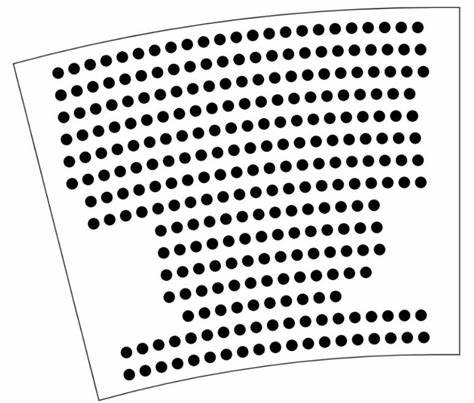

大作业实验说明

《Web前端技术实训》2026夏，清华大学软件学院 内部资料请勿外传

**大作业选题一：SmartCinema智能影院选座系统**

# 一、背景

电影院选座不仅是技术问题，更是用户体验、交互设计、行为心理学和产品设计问题。在现实观影过程中，用户会思考： 哪里观影效果最好？情侣喜欢坐哪里？家庭观影如何安排座位？老年人或儿童适合坐哪排？团体活动如何快速选座？

优秀的影院选座系统应该帮助用户： 快速决策、快速选座、减少操作步骤、获得更佳观影体验。因此，本项目要求学生从产品经理、UX设计师、交互设计师和前端工程师角度，共同设计一个智能影院选座小产品。

银幕

目标：快速找到最合适座位、降低用户决策成本、提升观影体验、提高购票效率

用户：

1. 大学生：多人同行，预算有限，快速选座；
2. 情侣：偏爱中后排，优先双人连续座位；
3. 家庭：多人观影，连续座位需求，照顾儿童和老人；
4. 老年人：操作能力弱，字体大，界面简洁；
5. 团体观众：5~20人，要求同排连续座位

设计原则：

必须遵循“别让用户思考（Don't Make Me Think）”原则，要思考通过系统主动推荐座位和优化操作流程，让用户快速完成选座与购票。

价值：

1. 让用户专注观影体验，而非操作；
2. 提升整体用户满意度；
3. 发挥创作能力，提升产品设计和UX思维

# 二、实验要求

## 功能设计要求：

### 模块1：智能推荐选座

输入信息：观众年龄、人数、观影类型，自动推荐最佳区域与座位。规则示例：青少年：避开前三排；老年人：避开最后三排；情侣：优先推荐中间区域连续双座；家庭：优先推荐中后排连续座位；团体：5~20人，要求同排连续座位，自动寻找同排连续空位

### 模块2：手动选座模式

手动选座支持单选、多选（Ctrl+鼠标点击）；拖拽选座（高级加分）；支持与推荐座位交互

### 模块3：影院热度地图

使用Canvas绘制观众热度分布；色彩标识：红色：热门区域；黄色：一般区域；绿色：冷门区域；帮助用户快速判断座位选择功能

### 模块4：观影体验评分

系统根据座位计算观影体验：视角；与银幕距离；周围空位情况。输出评分：极佳、优秀、一般。提供推荐理由，帮助用户理解选择逻辑

### 模块5：无障碍模式

支持大字体模式；高对比度模式；色盲友好模式；可选语音提示

### 模块6：订单中心

支持预订、取消预订、购票、退票；所有数据存储在LocalStorage或本地JSON文件；无后端数据库依赖

## 交互设计要求

提交用户操作流程图，操作流程步骤尽量简化（≤3步），界面交互符合用户逻辑与思维习惯

## 视觉设计要求

强调科技感和美学。需要提交设计文档：色彩方案，布局设计，字体选择，设计风格说明。可参考网站：Apple、Tesla、OpenAI、Netflix、猫眼电影、淘票票

## 技术要求

必须使用 Canvas 绘制电影院布局

不允许使用第三方Chart库（ECharts、D3、AntV等）

前端技术：HTML5、CSS3、JavaScript

支持PC、iPad、手机端，响应式布局

数据存储：LocalStorage 或 JSON 文件

## AI协同开发要求

可使用开发工具内置的AI编程大模型（ChatGPT、Claude、Cursor、Trae等）辅助开发

必须提交AI开发说明书：产品设计过程，用户分析过程，AI生成内容，学生修改内容，用户体验优化过程，设计决策说明。强调独立思考与产品判断能力

# 评分说明

评分时将使用任选PC、手机、平板电脑浏览器最新稳定版，无需考虑旧版的浏览器。

## 基本功能设计和实现（30分）：

登录注册功能：用户登录注册，普通用户注册获得会员资格，登录认证方可操作。管理员用户登录可以进入后台操作。（10分）

主界面：画出来座位图，电影院三个放映厅有小厅100座、中厅200座、大厅300座，小厅每排10座，中厅每排20座，大厅每排30有座位号，共10排，每个座位标明座位号排号，空座绿色、选中未售座位黄色、已售座位红色。影院放映厅是弧形，因此座位也要是弧形排列。确定用Canvas技术来绘制上图，并且未用任何第三方Chart库来实现。（20分）

## **模块功能设计和实现（60分）**

模块1：智能推荐选座（10分）

观众分为成年人、老年人和少年。选座选项分为个人票、情侣票、家庭票、团体票。个人票需要能够输入姓名、年龄。团体票输入人数、成员姓名和年龄。排座规则：少年（15岁以下）不能坐前三排；老年人（60岁以上）不能坐最后3排；情侣优先推荐中间区域连续双座；家庭优先推荐中后排连续座位；非以上类别成年人可以随意坐；团体票（5-20人）成员不能分开做要坐同一排，团体中有老年人或者少年要遵循上述规则。针对上述观众年龄和规则，要求实现智能推荐选座。

模块2：手动选座模式（5分，拖拽+5分）

手动选座可单选，多选（Ctrl+鼠标单击座位），支持与推荐座位交互，即推荐座位不满意，再手动选择其他座位。

模块3：影院热度地图（10分）

通过算法来显示放映厅的观众热度分布，哪些座位是热门选择。色彩标识：红色热门区域，黄色一般区域，蓝色冷门区域。能够动态显示一周内的厅内热度区域变化。帮助用户快速判断座位选择功能，确认要使用Canvas绘制观众热度分布。

模块4：观影体验评分（10分）

系统根据座位计算观影体验，评分指标：视角、与银幕距离、周围空位情况，输出评分结果：极佳、优秀、一般。观众评分，观众观影后手动评分，与系统评分之后综合结果。

模块5：无障碍模式（10分）

系统支持大字体模式、高对比度模式、色盲友好模式、可选语音提示。以帮助老年残障人士使用。

模块6：订单中心（10分）

系统支持预订、取消预订、购票、退票，所有数据存储在LocalStorage或本地JSON文件，可无后端数据库依赖。

## **视觉设计和交互设计要求（5分）**

设计很具有科技感，符合软件设计艺术美学，需要提交设计文档，描述色彩方案、布局设计、字体选择、设计风格说明。提交用户手册（可以画流程来替代），用户操作不多于3步就能完成，界面交互符合用户操作习惯。

## **说明文档（5分）**

提交产品设计过程说明、用户分析过程说明、AI生成内容说明、学生修改内容及思路说明、用户体验优化过程记录、设计决策和思路说明。文档要对实现设计实现全过程中的思路历程、遇到问题及解决办法进行描述，并且列出所有参考资料。

## **额外加分项（10分）**

● AI观影问答式顾问（3分）

○ 能够根据用户输入自动推荐最佳座位

○ 能够提供推荐理由（如视角、噪音、便捷性）

● 拖拽选座、动画交互优化（2分）

● WebSocket实时座位更新（多人在线模拟）（3分）

● 自设计影院布局或个性化界面（2分）

# 四、作业提交

请在网络学堂提交一个zip的压缩包，文件名为“组名\_大作业1”，压缩包中包括本次实验的源代码、说明文档以及其他必要的文件。

推荐将源码整理为1个html文件，命名为index.html，且可以直接用浏览器打开以便于评分。实现为其他形式需要在文档中对代码结构和使用方法做出清晰的说明。

说明文档请转成pdf，命名为report.pdf，在文档中请务必写明姓名、学号和联系邮箱。

# 五、注意事项

1、请勿互相抄袭，用到的参考资料或大模型参考请准确列出，如有雷同、不规范引用等学术不端情况，涉及的作业可能会被扣除分数甚至取消成绩。

2、请务必合理安排时间，尽早开始推进工作并及时提交作业，迟交作业可交至助教邮箱（wangzian24@mails.tsinghua.edu.cn或2975587905@qq.com），每迟交一天扣除10%的分数。