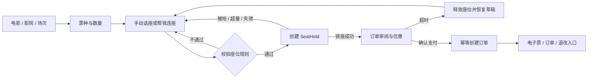

# SmartCinema 商业化产品与体验重构路线图

> 状态：本地需求闭环已完成
> 建立日期：2026-07-18  
> 工作分支：`zcjx/smart_cinema`（不得直接在 `main` 上实施）  
> 前置成果：`doc/REFACTOR_ROADMAP.md` 已完成代码分层、状态可靠性、缺陷修复与基础视觉系统  
> 本轮性质：第二阶段产品重构，不是上一轮的补丁或换肤  
> 研究日期：2026-07-18

> **范围校准（2026-07-18）：** 本地项目不继续扩展真实支付、支付渠道退款回调、二维码验票、完整账户或卖品。后续以 `doc/PROJECT_REQUIREMENTS_CLOSURE.md` 为需求基线：补回被旧 UI 删除但仍有价值的本地能力，并以更合理的商业交互形态完成闭环。

## 1. 审计结论

上一轮完成了必要且真实的技术地基，但**尚不是最基础、最根本的产品重构**。

已经正确完成的部分包括：领域/应用/基础设施/UI 分层、库存与订单一致性、身份边界、存储迁移、弹窗与输入可靠性、响应式 Canvas、无障碍基础、测试与 QA 矩阵。这些成果应保留，不应为了“重构感”推倒重来。

仍然没有触及的根因是：当前应用的领域语言和信息架构仍来自一个“影院功能演示台”，而不是一个真实的“购票产品”。代码里只有技术性的影厅类型与星期，没有电影、影院、真实开场时间、票种、销售状态、座位类型、锁座、费用、退改政策和电子票。页面因此只能把选座、推荐、评分、热图、订单、设置与聊天同时展示，无法形成清晰的购买决策链。

本轮必须从以下顺序重构：

1. 商业规则与产品模型；
2. 购买状态机与信息架构；
3. 模块删补和位置关系；
4. 页面与组件；
5. 视觉、反馈和动效；
6. 全流程验证。

## 2. 长期 Goal

将 SmartCinema 从“功能型选座演示”升级为遵循真实影院交易逻辑的产品级购票体验：用户在明确的电影、影院、场次和票价上下文中，先确定票数/票种，再完成可理解、可访问、有库存保护的选座，在锁座时限内审阅价格与退改政策并确认订单；异常、冲突、过期和售后均可恢复。

完成标准不是页面变漂亮，而是同时满足：

- 产品模型能够表达完整购票交易；
- 核心任务不被演示、分析或设置功能打断；
- 所有价格、库存与政策状态在付款前可见；
- 移动端持续可见当前选择、总价与下一步；
- 锁座、冲突、过期、重复提交和退票具备领域测试；
- 无障碍席位以业务规则而非单纯颜色呈现；
- v2 本地数据可迁移、可回退，既有正确行为不丢失。

## 3. 竞品与规则证据

本项目不复制任一产品的外观；以下资料只用于提取稳定的交易规律。

| 证据 | 可采用的业务规律 | 对 SmartCinema 的影响 |
| --- | --- | --- |
| [Cinemark 官方购票 FAQ](https://mobile.cinemark.com/faq-tickets-purchases-refunds) | 选择影院、电影、日期和时间后，先选票种/票数，再选座，最后核对影院、日期、时间与价格 | 场次上下文和票种必须先于座位；结算必须再次核对完整场次 |
| [淘票票开放平台锁座接口](https://developer.alibaba.com/docs/api.htm?apiId=30171) | 锁座是异步且可失败的独立业务；有幂等键、处理中、成功、超量、被抢、场次失效等状态；常见锁定 600–900 秒 | `CheckoutIntent` 不能继续充当“伪锁座”；新增 `SeatHold` 聚合与明确失败恢复 |
| [CGV 香港在线选座](https://cgv.com.hk/zh/seat/index/11063818) | 单次交易限制票数，并要求在有限时间内完成付款 | 增加每单上限、倒计时、过期释放和重新选座入口 |
| [AMC Reserved Seating FAQ](https://www.amctheatres.com/faqs/theatre-info) | 预留座位的核心价值是保证具体座位并降低售罄焦虑 | 文案与反馈应强调“座位已为你保留到何时”，而非展示空座/已售统计 |
| [ODEON 无障碍订票说明](https://help.odeon.co.uk/hc/en-gb/articles/360010226860-I-have-a-disability-Is-there-anything-I-should-know-about-booking-tickets) | 先确认场次所在影厅可达，再选择无障碍票种和席位；陪同票是独立规则 | 场次需携带无障碍能力；轮椅位、陪同位和票种联动 |
| [ADA Ticket Sales 指南](https://www.ada.gov/resources/ticket-sales/) | 无障碍席位应以同等渠道、同等阶段销售，呈现同等详细的位置/价格/可用信息，并支持相邻陪同席 | 无障碍不能是隐藏开关或单一颜色；需提供文字/图形标识、详情和相邻席约束 |
| [Fandango 票务政策](https://www.fandango.com/policies/ticket-and-concessions-policy) | 退换受影院、时间、支付和整单条件影响；电子确认包含取票方式 | 退改资格必须是订单快照的一部分；订单成功页需提供电子票与售后入口 |

## 4. 根因级 Before / After / Why

| Before | After | Why |
| --- | --- | --- |
| Header 直接选择“小/中/大厅”和星期 | 展示电影、影院、日期、具体时间、语言/制式；“更换场次”返回场次选择 | 用户购买的是某电影的某一场，不是抽象影厅配置 |
| 选座前没有票数，选多少座位就买多少票 | 先选择成人/儿童/学生/长者等票种与数量，再要求座位数严格匹配 | 票价、资格、最大票数和座位数量都需要确定输入 |
| Canvas 同时编码热度、冷热、推荐、已售、已选等大量颜色 | 采用可聚焦 DOM 座位按钮；只保留可选、已选、已售/锁定、无障碍、陪同、价格区等交易状态 | 逐座语义、键盘、触控、价格说明和错误定位比绘图性能更重要；300 个 DOM 座位可控 |
| 右侧完整推荐问卷要求年龄、关系类型和成员姓名 | 票数确定后提供“一键连座”和可选偏好 chips（居中、靠后、近过道、少走台阶） | 姓名是无必要 PII；年龄/关系问卷增加阻力且与推荐目标弱相关 |
| “观影体验评分”与手动评分出现在付款前 | 选座时只显示可解释的视野/距离提示；主观评分移动到已观影订单 | 购票阶段要帮助决策，而不是要求用户评价尚未发生的体验 |
| 独立热度地图占据第二个大画布 | 删除消费者路径中的热图；最佳观影区直接在座位图背景和推荐解释中表达 | 两张近似座位图造成重复阅读，热度不是可交易状态 |
| 空座、已选、已售统计占据黄金位置 | 改为“已选 X/Y 张”、座位 chips、单价/总价和剩余锁座时间 | 用户关心是否完成自己的购买，而非影院运营统计 |
| 订单卡位于长页面末端，移动端需滚动约 1.7 屏才可触达 | 桌面右侧 sticky 摘要；移动端底部 sticky 结算栏 | 下一步和当前成本必须持续可见，减少滚动记忆负担 |
| 登录是推荐和下单前的打断点 | 浏览与推荐允许游客使用；仅在创建锁座/支付身份确有需要时轻量登录，并保留草稿 | 推迟身份摩擦，不丢失已做选择 |
| `CheckoutIntent` 有过期时间但没有真实占用库存 | 新增 `SeatHold`：pending/held/expired/released/consumed，使用幂等键并进入库存可用性判断 | “进入结算页”与“座位真的被保留”不是同一事实 |
| 订单只包含 `showtimeId`、座位和总价 | 订单保存电影/影院/场次/票种/席位/价格/政策快照、取票码和状态时间线 | 后续目录或价格变化不能改变已购票据含义 |
| 设置、主题色、备份、实时模拟、后台、AI 悬浮按钮都在购票主页 | 设置归入账户抽屉；备份/实时模拟/后台移到内部工具页；AI 改为选座内的可选“帮我选” | 核心购票页只保留完成交易所需内容 |
| 全局深色页面中嵌入巨大白色 Canvas | 使用明亮交易外壳 + 深色影院座位舞台，统一状态色、价格与层级 | 保持影院氛围，同时让表单、政策与金额具备高可读性 |
| 页面是功能卡片纵向堆叠 | 页面按“场次上下文 → 票数 → 座位 → 摘要/下一步”组织，结算与成功为独立步骤 | 信息架构必须反映用户目标和状态依赖，而不是代码模块清单 |

## 5. 目标购票漏斗



### 页面层级

1. **场次页**：影片、影院、日期、场次、价格起、语言/制式、无障碍能力；
2. **选票与选座页**：场次摘要、票种步进器、座位图、推荐、持续可见的订单摘要；
3. **订单审阅页**：锁座倒计时、票/座明细、价格拆分、优惠、退改规则和身份；
4. **成功页**：文字取票码、入场信息、导航、取消/退票资格；
5. **账户页**：订单、偏好和辅助功能；
6. **内部工具页**：模拟、备份、用户/库存管理，不进入消费者导航。

## 6. 功能删补与重定位

### 保留并增强

- 手动选座；
- “帮我选”推荐，但输入改为票数和少量偏好；
- 库存隔离、订单幂等、身份隔离与数据迁移；
- 键盘、触控、大字体、色盲与 reduced-motion；
- 订单历史和取消/退款，但改为真实政策驱动；
- 浏览器本地演示模式及测试注入能力。

### 合并

- 系统评分 + 推荐说明 → 座位质量标签与“为什么推荐”；
- 缩放、平移、定位 → 单一座位图导航工具；
- 选中统计 + 订单摘要 → sticky 购票摘要；
- 登录/注册 → 统一身份 sheet/dialog，并保留购票草稿。

### 移出核心路径

- 历史订单 → 账户页；
- 主观评分 → 已观影订单；
- 主题/辅助设置 → 账户偏好抽屉；
- 数据导入导出、实时模拟、后台 → 内部工具页。

### 从消费者页面删除

- 独立热度地图；
- 推荐表单中的成员姓名；
- 关系类型和泛化年龄问卷；
- 空座/已售运营统计；
- 自定义主题色调色盘；
- 浮动 AI 聊天入口；
- 可直接改变技术影厅结构的“小/中/大厅”选择器。

### 新增

- 电影、影院、场次、票种与销售状态；
- 具体开场/结束时间、语言、字幕、2D/3D/IMAX 等标签；
- 票数上限和票种资格说明；
- 座位类型、价格区、过道、入口、轮椅位、陪同位；
- 连座、孤座、跨区、无障碍席位确认等规则；
- 锁座倒计时、冲突刷新、过期恢复；
- 小计、服务费、优惠、应付总额；
- 场次级退改规则；
- 订单快照、电子票/取票码、状态时间线；
- 关键空态、失败态、无座态和即将开场状态。

### 明确延期

- 卖品/餐饮作为锁座后的可跳过增购，不进入第一批核心实现；
- 会员订阅、积分、礼品卡与真实支付网关不在本地演示版首轮实现；
- 多影院地理搜索不先做定位权限，首轮使用固定影院目录。

## 7. 目标领域模型（Storage v3）

```text
Catalog
├── Movie
├── Cinema
├── Auditorium
├── Showtime
│   ├── movieId / cinemaId / auditoriumId
│   ├── startsAt / endsAt / format / language
│   ├── accessibilityFeatures
│   ├── salesState
│   └── pricingPolicyId / refundPolicyId
└── TicketType

BookingDraft
├── showtimeId
├── ticketItems[]
├── selectedSeatIds[]
└── recommendationPreferences

SeatInventory
├── soldSeatIds[]
├── activeHoldsBySeatId
└── revision

SeatHold
├── id / idempotencyKey / ownerId
├── showtimeId / seatIds[] / ticketItems[]
├── status: pending | held | expired | released | consumed
├── createdAt / expiresAt
└── pricingQuote

Order
├── transaction identity and owner
├── movie/cinema/showtime snapshot
├── tickets/seats/pricing snapshot
├── refund policy snapshot
├── ticketCode / qrPayload
└── confirmed/cancelled/refund timeline
```

### 不变量

- 票数必须为 1–20；9–20 张仅适用于团体同行；
- 选中座位数必须等于票数；
- 不允许选择已售、他人有效锁定或结构性不可售座位；
- 同一订单座位必须属于同一场次和同一影厅区块；
- 默认不制造单个孤立空座；边界、过道、已售块和无障碍区按规则豁免；
- 轮椅位与陪同位保留明确语义，不能仅凭颜色推断；
- `SeatHold` 成功后才进入结算；失败不清空票种与偏好；
- 过期/释放后座位重新可售，`consumed` 后只能由对应订单占用；
- 价格由场次、票种、座位价格区和费用政策计算，UI 不自行求价；
- 订单保存不可变快照，不依赖当前目录反查；
- 所有创建锁座和确认订单操作幂等。

## 8. 视觉与交互方向

### 视觉结构

- 默认采用浅色交易外壳，强调阅读、金额与政策可信度；
- 座位图使用独立深色“影院舞台”，通过空间和亮度建立沉浸感；
- 主色用于选择与主要 CTA，危险色只用于失败/不可逆提醒；
- “已售”和“他人锁定”可共享不可选层级，但文字提示需区分；
- 所有座位状态同时使用形状/图标/文字，不依赖颜色；
- 价格、场次和选中座位使用等宽数字或 tabular numbers，减少跳动；
- 一屏只设一个明确主操作。

### 交互结构

- 桌面：座位舞台为主区域，右侧 sticky 摘要；
- 移动：紧凑场次摘要 + 可横向浏览的座位舞台 + 底部 sticky 总价/CTA；
- 点击座位立即更新座位 chip、计数与价格，不弹出确认框；
- 达到票数后继续点新座位时给出替换提示，而不是静默失败；
- 无障碍/陪同位首次选择展示简短、可访问的条件说明；
- “帮我选”直接预览一个连座方案，可换一组，不打开长问卷；
- 冲突后保持票种与偏好，突出失效座位并提供一键重新推荐；
- 锁座倒计时在结算页持续可见，低于两分钟才升级提醒强度。

### Motion 约束（Emil design engineering）

- 高频选座与键盘导航不做位移动画；
- 座位选中只使用 120–160ms 的颜色/描边/轻微 scale 反馈；
- 页面/summary 状态 transition 控制在 180–240ms；
- 动态 UI 使用可中断 transition，只动画 `transform` 与 `opacity`；
- hover 只在 `(hover: hover) and (pointer: fine)` 生效；
- reduced-motion 移除位移与缩放，保留即时颜色/描边反馈；
- Modal 从中心、popover 从触发点展开；
- 倒计时、价格变化和键盘操作不添加装饰动画。

## 9. 分阶段实施计划

### Phase 0：证据与基线（已完成）

- [x] 复核当前仓库结构、测试与工作分支；
- [x] 真实浏览器检查 1440px 与 390px 当前任务路径；
- [x] 收集国内外官方商业规则；
- [x] 完成功能删补、Before/After/Why 和目标漏斗；
- [x] 将当前关键截图、DOM/滚动指标和测试结果写入产品基线报告；
- [x] 冻结 Storage v2 迁移样本。

退出门槛：后续工作无需聊天上下文即可说明“为什么改、改什么、如何验收”。

### Phase 1：契约优先的产品核心（已完成）

- [x] 建立 Movie、Cinema、Auditorium、Showtime、TicketType、PricingPolicy；
- [x] 建立 BookingDraft、SeatHold 与订单快照；
- [x] 实现票数、连座/孤座、价格区、无障碍与最大购票约束；
- [x] 实现 hold 状态机、过期释放、幂等与库存 revision 冲突；
- [x] 设计 Storage v3 和 v2→v3 迁移；
- [x] 为所有不变量先写确定性领域测试。

退出门槛：不依赖 DOM 即可完整演练“选场次→选票→选座→锁座→确认/过期”。

### Phase 2：购票外壳与场次上下文（主切片已完成）

- [x] 建立场次目录 fixture 和场次选择页；
- [x] 重写 header、步骤导航、电影/影院/场次摘要；
- [x] 建立票种步进器，并在登录/锁座步骤保留当前草稿；
- [x] 移除消费者页面中的技术影厅/星期切换；
- [x] 建立停售、无可用场次和初始化失败状态；
- [x] 增加跨刷新 BookingDraft 恢复；
- [x] “即将开场”专用营销提示不属于本地需求；销售关闭状态已有统一提示与禁用语义。

退出门槛：用户不看座位图也能明确自己正在购买什么、何时何地观看、票价从何开始。

### Phase 3：座位决策重构（主切片已完成）

- [x] 建立 100/200/300 座三种语义化 DOM 影厅，Canvas 与 `legacy.html` 已退出生产仓库；
- [x] 表达银幕、过道、排号、价格区、轮椅位与陪同席；
- [x] 实现单一 Tab 停点、方向键、Space、焦点保持和触控容器内横向浏览；
- [x] 将推荐改为票种、同行方式与偏好 chips 驱动的确定性连座，覆盖儿童/长者与 5–20 人团体规则；
- [x] 将热度与视野/距离/周边/价格四维体验整合为同一座位图上的可选决策辅助；
- [x] 建立 desktop sticky summary 与 mobile bottom bar；
- [x] 影厅入口定位和多轮换座不是本地闭环要求；现有过道、无台阶、热度和四维说明已覆盖座位决策。

退出门槛：320–1440px 均可完成精确选座；读屏用户可逐座获知排/座/价格/状态；CTA 始终可触达。

### Phase 4：锁座、结算与订单（可运行闭环、恢复与基础售后已完成）

- [x] 选座完成后创建真实 `SeatHold`；
- [x] 建立倒计时、价格拆分、退改政策披露和返回改座；
- [x] 登录延后到锁座后的确认步骤，访客 owner 可在登录后消费同一 hold；
- [x] 实现冲突时刷新库存、超时释放和显式关闭释放；
- [x] 重构确认订单为消费 hold 的幂等事务；
- [x] 建立成功凭证、紧凑取票码和账户订单列表；
- [x] 恢复刷新中的有效 hold，并在启动时原子清扫过期 hold；
- [x] 补全订单状态时间线与政策快照驱动的整单取消/退款资格；
- [x] 以文字取票码、本地演示确认、政策驱动取消和库存释放完成项目闭环；真实支付、渠道回调与二维码验票明确不在本轮范围。

退出门槛：任何失败都不产生幽灵订单或永久占座；用户知道座位保留到何时、支付什么、能否退款。

### Phase 5：账户与内部能力分流

- [x] 建立第一版账户订单 Dialog；
- [x] 将大字体、高对比、色觉友好和减少动态移入账户/访客观影辅助 Dialog；
- [x] 从消费者偏好中删除主题色、realtime、备份等非购票能力；
- [x] 完整账户资料页不在本地项目范围，订单与辅助偏好已具备独立入口；
- [x] 将本地观影体验评分重构为选座决策提示，不在购票前要求主观评价；
- [x] 删除 `legacy.html`，消费者与运维分别收口到 `index.html` 和 `internal.html`；
- [x] 使用独立 v3 内部运维工具取代迁移操作台；
- [x] 从生产入口删除浮动 AI，保留上下文“帮我选”；
- [x] 清理失去入口的旧 controller、CSS 和测试，并用架构边界测试阻止回流。

退出门槛：消费者购票页不存在后台、备份、模拟和无关个性化噪声。

### Phase 6：视觉系统与动效收口

- [x] 建立交易色、座位状态、票价、排版、间距、层级和 motion tokens；
- [x] 完成 Button、Stepper、ShowtimeChip、Seat、SummaryDock、Timer、PolicyNotice 首版组件；
- [x] 完成根因级 Before/After/Why 审查；
- [x] 验证亮/暗舞台、高对比、色盲、大字体和 reduced-motion；
- [x] 高频选座无位移动画，Modal 只使用 160ms transform/opacity 并支持 reduced-motion；
- [x] 完成高对比、色盲和大字体的消费者页面人工视觉验收。

退出门槛：视觉层级与业务优先级一致，不存在为了“高级感”牺牲可读性或响应速度的动画。

### Phase 7：全矩阵验收与收尾

- [x] Node 领域/应用/迁移测试；
- [x] 浏览器核心漏斗、锁座释放、重复确认与弹窗契约；
- [x] 320、390、768、1024、1440px 无页面横向溢出；
- [x] 鼠标、触控滚动、键盘与逐座读屏语义自动化；
- [x] reduced-motion 已完成自动化与视觉验收；真实读屏保留为目标设备人工验收边界；
- [x] 新用户、v2 迁移、损坏数据、草稿/hold 刷新恢复和并发冲突；
- [x] 刷新恢复与 hold 过期清扫；
- [x] 核心流程控制台与 DOM 安全自动化；
- [x] 性能和死代码审计：两个入口可达 72/72 源码，本地 300 座页面无明显等待；
- [x] README、TESTING、架构、迁移与 QA 报告更新。

退出门槛：所有量化验收项有当前测试或浏览器证据，旧路线图的正确性不倒退。

## 10. 量化验收标准

| 维度 | 标准 |
| --- | --- |
| 核心路径 | 选定场次后，仅需“票数/票种 → 座位 → 审阅支付”三个主要决策阶段 |
| 隐私 | 创建锁座/身份步骤前不要求姓名、邮箱或成员名单 |
| 可见性 | 移动端选座时总价、已选 X/Y 与主要 CTA 持续可见 |
| 一致性 | 任意时刻票数 = 所需座位数；不匹配不能锁座 |
| 锁座 | pending、success、conflict、expired、released、consumed 均有测试与 UI |
| 恢复 | 冲突/过期后保留场次、票种和推荐偏好，最多一次操作重新选座 |
| 价格 | 付款前同时展示票价、小计、费用、优惠和总额；订单保存同一快照 |
| 无障碍 | 逐座提供排/座/类型/价格/状态；无障碍与陪同席规则可被键盘和读屏完成 |
| 响应式 | 320px 无页面横向溢出；座位舞台内部可导航；CTA 不被浏览器底栏遮挡 |
| 动效 | 高频交互无等待；必要 transition ≤240ms；reduced-motion 无位移/缩放 |
| 正确性 | 现有 105 个 Node 测试和 12 个浏览器契约不得无理由删除或降级 |
| 运行质量 | 核心流程控制台 0 未解释 error / unhandledrejection |

## 11. 风险与控制

| 风险 | 控制方式 |
| --- | --- |
| 直接重写 UI 导致领域模型继续缺失 | Phase 1 先完成纯领域契约和测试，UI 只能调用用例 |
| Storage v3 破坏既有用户/订单 | 固定 v2 fixture，双读单写迁移，迁移失败保留原数据并提供恢复说明 |
| DOM 座位图一次替换 Canvas 风险过高 | 新旧视图并存于测试期；生产入口切换后再删除旧渲染链 |
| 商业规则因影院差异过度硬编码 | 票数、孤座、退改、费用和 hold 时长均由 policy 对象配置 |
| 功能越加越多重新变成控制台 | 每个新增模块必须说明其所处漏斗阶段；非交易能力默认进入账户或内部工具 |
| 视觉改版掩盖行为回归 | 每阶段先跑领域/浏览器契约，再做该阶段视觉审查 |

## 12. 上下文恢复协议

任何上下文压缩、暂停或交接后，按以下顺序恢复：

1. 阅读根目录 `AGENTS.md`；
2. 确认 `git branch --show-current` 为 `zcjx/smart_cinema`；
3. 阅读本文件；
4. 阅读 `doc/REFACTOR_ROADMAP.md`，区分已完成技术基线与本轮产品目标；
5. 阅读最新阶段文档、`git status --short` 与最近提交；
6. 运行 `npm test`；
7. 只继续第一个未完成且满足前置条件的 Phase；
8. 每完成一个阶段，同步更新本文件状态、测试证据和关键决策。

## 13. 当前下一步

1. [x] 完成损坏 v3、性能、死代码和静态依赖审计；
2. [x] 以 `doc/PROJECT_REQUIREMENTS_CLOSURE.md` 逐项完成最终需求覆盖审计；
3. [x] 更新最终 QA、README 与 TESTING；下一步仅提交本地需求闭环里程碑。

### Phase 1 当前证据

- `doc/RFC_COMMERCIAL_DOMAIN_V3.md` 已接受并实现；
- 新增纯领域 Catalog、Money、BookingDraft、PricingQuote、SeatSelectionPolicy、ShowtimeInventory、SeatHold、CommercialOrder；
- 新增 DemoCatalogRepository 和 CommercialBookingService；
- v2→v3 迁移保留 v2 原 key 与迁移前备份，legacy 缺失字段不伪造；
- 应用层支持访客 hold、登录后确认、原子库存写入和幂等重试；
- Phase 1 当时的 Node 套件为 150/150 PASS；旧界面退出后的当前精简套件与最终验收结果见 `doc/PROJECT_REQUIREMENTS_CLOSURE_QA.md`。

### Phase 2–4 可运行切片证据

- `index.html` 已切换到商业购票漏斗；旧 `legacy.html`、跨页 `order.html` 与 Canvas/评分/热图/模拟器链已删除；
- `src/bootstrapCommercial.js` 是 v3 生产组合根，连续执行 v1→v2→v3 迁移并初始化确定性场次库存；
- `src/commercial.js` 只通过应用服务访问目录、库存、认证、锁座和订单，不直接访问 Web Storage；座位 DOM/键盘/焦点下沉至 `CommercialSeatMapController`，锁座确认/倒计时/认证叠层/释放/成单下沉至 `CommercialCheckoutController`；
- 生产入口已具备场次上下文、四票种 stepper、100/200/300 座三厅、1–20 人同行推荐、热度/四维体验、逐项价格、sticky 摘要和移动底栏；
- 访客可创建 10 分钟 hold，登录/注册后消费同一 hold，成功后生成取票码并进入账户订单；
- 登录 Dialog 有显式关闭键，输入框拖到遮罩释放和背景点击均不会关闭；叠层 Dialog 只允许最上层响应 Escape；
- 390px 实测页面级横向溢出为 0，座位图在 360px 容器内浏览 650px 内容；
- `internal.html` 已通过管理员权限门提供 v3 库存、锁座、订单、脱敏用户和备份恢复；危险操作均二次确认；
- 生产两个入口的 69 个 JavaScript 文件全部可达；Node 架构契约阻止旧 UI 链与跨层浏览器依赖回流；
- 多目录已提供 3 部电影、2 家影院、3 个营业日与 24 个确定性场次；应用层统一派生可售状态；
- `CommercialCatalogController` 负责组合选择、最近可售回退、禁用规则、焦点归还和响应式目录视图；
- Node 当前为 85/85 产品与迁移契约；浏览器商业、架构与运维契约为 19/19 PASS、0 XFAIL、0 XPASS、0 ERROR；
- 详细证据与延期项见 `doc/COMMERCIAL_UX_PHASE_2_QA.md`。
