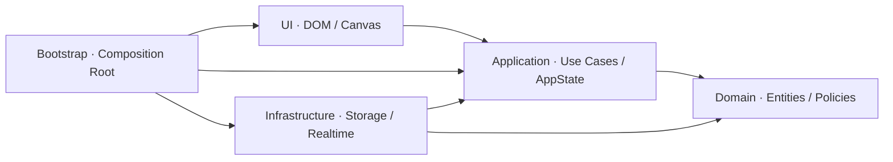

# SmartCinema 目标架构 RFC

> 状态：Accepted for implementation
> 日期：2026-07-18
> 适用分支：`zcjx/smart_cinema`
> 关联文档：`REFACTOR_ROADMAP.md`、`DOMAIN_CONTRACTS.md`、`STORAGE_SCHEMA_V2.md`

## 1. 决策摘要

SmartCinema 保持原生 JavaScript、ES Modules 和零运行时依赖，但从“页面脚本直接协调所有对象”迁移为分层应用：



依赖只能朝图中箭头方向流动。`bootstrap.js` 是唯一同时了解 UI、应用端口和基础设施实现的组合根。

核心决策：

1. 领域状态不依赖 DOM、Canvas、LocalStorage、timer 或浏览器事件；
2. UI 只发送命令并渲染 AppState，不直接读写持久化；
3. Application 通过 Repository/Clock/IdGenerator 端口使用外部能力；
4. LocalStorage v2 使用单一状态 envelope，让订单与库存可在一次 JSON 写入内共同提交；
5. 当前用户选择、远端临时占座和已售库存是三种不同状态；
6. 跨页结算使用带幂等键的 CheckoutIntent；
7. 页面级文件只负责结构和启动，不再承载业务事务。

## 2. 目标与非目标

### 目标

- 使库存、订单、身份、选择和远端占座各有唯一事实源；
- 让核心用例可在 Node 中无 DOM 测试；
- 让 `src/app.js` 最终只保留组合与页面启动职责；
- 让首页与订单页复用同一 Booking 用例，而不是各自实现订单逻辑；
- 为 Storage v2、旧数据迁移和失败恢复提供明确边界；
- 为后续 Modal、响应式和视觉系统重构提供稳定 UI 组件边界。

### 非目标

- 不引入 React、Vue、状态管理库、bundler 或运行时框架；
- 不伪装成真实服务端认证、支付或 WebSocket；
- 不在架构迁移阶段同步进行视觉改版；
- 不维持 v1/v2 两套可写业务模型；v1 仅作为一次性迁移输入和只读备份。

## 3. 目标目录

```text
src/
├── shared/
│   ├── Result.js                 # 统一成功/错误结果
│   ├── ValidationError.js
│   └── collections.js            # 唯一集合、不可变复制等纯工具
├── domain/
│   ├── cinema/
│   │   ├── Hall.js
│   │   ├── Showtime.js
│   │   ├── Seat.js
│   │   ├── SeatInventory.js
│   │   ├── LocalSelection.js
│   │   └── RemoteHold.js
│   ├── order/
│   │   ├── Order.js
│   │   ├── OrderStatus.js
│   │   └── BookingPolicy.js
│   └── user/
│       ├── User.js
│       └── UserRole.js
├── application/
│   ├── ports/
│   │   ├── StateRepository.js
│   │   ├── CheckoutIntentRepository.js
│   │   ├── Clock.js
│   │   └── IdGenerator.js
│   ├── selection/
│   │   ├── ChangeShowtime.js
│   │   ├── ToggleSeat.js
│   │   └── ApplyRecommendation.js
│   ├── booking/
│   │   ├── StartCheckout.js
│   │   ├── ConfirmCheckout.js
│   │   └── CancelOrder.js
│   ├── auth/
│   │   ├── Login.js
│   │   ├── Register.js
│   │   └── Logout.js
│   ├── scoring/
│   │   └── CalculateExperience.js
│   ├── settings/
│   │   └── UpdateSettings.js
│   ├── AppState.js
│   └── AppController.js
├── infrastructure/
│   ├── storage/
│   │   ├── LocalStateRepository.js
│   │   ├── SessionCheckoutIntentRepository.js
│   │   ├── StorageValidator.js
│   │   └── MigrateV1ToV2.js
│   ├── realtime/
│   │   └── RealtimeSimulatorAdapter.js
│   └── browser/
│       ├── BrowserClock.js
│       └── BrowserIdGenerator.js
├── ui/
│   ├── components/
│   │   ├── Modal.js
│   │   ├── Toast.js
│   │   ├── AuthForm.js
│   │   └── OrderList.js
│   ├── controllers/
│   │   ├── MainPageController.js
│   │   └── OrderPageController.js
│   ├── canvas/
│   │   ├── SeatCanvasRenderer.js
│   │   ├── SeatCanvasInput.js
│   │   └── HeatmapRenderer.js
│   └── views/
│       ├── MainPageView.js
│       └── OrderPageView.js
└── bootstrap.js
```

迁移期间旧 `src/core/`、`src/modules/` 和 `src/utils/` 可以暂存，但新模块不得反向依赖旧 UI 协调代码。每迁移完一个垂直切片就删除对应旧写路径。

## 4. 分层职责与禁止依赖

| 层 | 可以做 | 不可以做 |
| --- | --- | --- |
| shared | 纯校验、Result、无业务含义工具 | 依赖任一上层模块或浏览器全局 |
| domain | 实体、不变量、状态转换、领域策略 | 访问 DOM、Storage、网络、随机数、当前时间 |
| application | 编排用例、权限检查、事务边界、生成 AppState | 查询 DOM、拼 HTML、直接调用 LocalStorage |
| infrastructure | 实现端口、序列化、迁移、浏览器适配 | 决定 UI 呈现或绕过领域不变量 |
| ui | DOM/Canvas 输入、渲染、焦点、可访问性 | 保存订单、改库存、直接访问 local/sessionStorage |
| bootstrap | 创建实例并注入依赖 | 承载可复用业务规则 |

用 `rg` 可执行的阶段 3 边界检查：

```bash
rg -n "document\.|window\.|localStorage|sessionStorage" src/domain src/application
rg -n "from ['\"].*/ui/" src/domain src/application src/infrastructure
```

两个命令在架构迁移结束时都必须无结果；Clock/IdGenerator 等浏览器能力只能出现在端口实现中。

## 5. 状态所有权

| 状态 | 唯一事实源 | 生命周期 | 允许修改者 |
| --- | --- | --- | --- |
| 用户与会话 | StateRepository v2 | 跨刷新 | auth use cases |
| 已售库存 | `inventoriesByShowtime` | 跨刷新 | ConfirmCheckout / CancelOrder |
| 订单 | `ordersById` | 跨刷新 | booking use cases |
| 设置 | `settingsByUser` | 跨刷新 | UpdateSettings |
| CheckoutIntent | SessionCheckoutIntentRepository | 当前标签页结算 | Start/ConfirmCheckout |
| LocalSelection | AppState | 当前页面与当前场次 | selection use cases |
| RemoteHold | AppState 的独立 Map | 过期或连接结束 | realtime adapter command |
| 推荐结果 | AppState 派生状态 | 输入变化即失效 | recommendation use case |
| 综合评分 | AppState 派生状态 | 座位/手动评分变化即失效 | scoring use case |
| Modal/Toast/focus | UI component state | 短暂 | UI controllers/components |

`Seat` 不再同时以 `status`、`isSelected` 和集合成员关系表达同一状态。渲染态由以下优先级派生：

```text
sold > local-selected > remote-held > recommended > available
```

## 6. Application 端口

### StateRepository

```js
class StateRepository {
    read() {}
    update(expectedRevision, mutate) {}
    subscribe(listener) {}
}
```

- `read()` 返回已经校验且不可由调用方原地修改的快照；
- `update()` 在一个 state envelope 内同时修改订单与库存，成功后 revision + 1；
- revision 不匹配返回 `STATE_CONFLICT`，用例重新读取并重新校验；
- `subscribe()` 只通知外部标签页/适配器变化，不承担业务合并。

### CheckoutIntentRepository

```js
class CheckoutIntentRepository {
    get() {}
    save(intent) {}
    consume(intentId, orderId) {}
    clear() {}
}
```

### Clock 与 IdGenerator

所有时间和 ID 都通过注入端口产生。测试使用 FakeClock/SequenceIdGenerator，禁止在领域与用例中直接调用 `Date.now()`、`new Date()`、`Math.random()` 或 `crypto.randomUUID()`。

## 7. 核心用例

### ConfirmCheckout

```text
读取 CheckoutIntent
  → 校验当前 userId、showtimeId、有效期与 intent 状态
  → 按 idempotencyKey 查询已有订单
      → 已存在：返回同一订单（成功且不重复写）
  → StateRepository.update(revision)
      → 重新校验座位全部可售
      → 写 confirmed Order
      → 同一 envelope 内写 soldSeatKeys
  → 标记 intent consumed
  → 返回订单
```

按钮禁用是 UI 防抖；`idempotencyKey` 和 repository 事务才是正确性保证。

### CancelOrder

```text
读取当前用户和订单
  → 校验订单归属或管理员权限
  → 校验状态转换
  → StateRepository.update(revision)
      → 订单变为 cancelled
      → 从同一 showtime 库存移除 seatKeys
  → 返回退款/取消结果
```

### ChangeShowtime

- 使用 canonical `showtimeId` 读取库存；
- 清空或显式确认跨场次 LocalSelection，不静默搬运座位；
- 清空推荐、系统评分、综合评分和过期 RemoteHold；
- UI 只渲染新 AppState。

## 8. 错误与 Result

用例不向 UI 抛出可预期业务异常，统一返回：

```js
{
    ok: false,
    error: {
        code: 'SEAT_UNAVAILABLE',
        message: '部分座位已不可用',
        details: { seatKeys: ['5-6'] }
    }
}
```

错误码由 `DOMAIN_CONTRACTS.md` 冻结。UI 根据 code 决定焦点、Toast 或表单内错误，但不得解析 message 来推断逻辑。

## 9. 渲染与事件模型

- AppController 是应用命令入口，成功后发布新的只读 AppState；
- MainPageView/OrderPageView 只渲染快照；
- SeatCanvasInput 将 pointer/keyboard 转为 `ToggleSeat` 等命令；
- SeatCanvasRenderer 接收纯 render model，不持有可写 SeatData；
- Modal、Toast 和 AuthForm 是独立 DOM 组件，不由业务服务生成 HTML；
- 高频 pointer move 可以只更新 UI 暂态，但 pointer commit 必须调用应用命令。

## 10. 测试分层

| 层 | 主要覆盖 | 环境 |
| --- | --- | --- |
| domain | ID、库存、选择、订单状态机、推荐与评分策略 | Node，纯函数 |
| application | 权限、幂等、事务、冲突重试、失效规则 | Node，内存端口 |
| infrastructure | v1→v2 迁移、损坏数据、revision、序列化 | Node，Storage stub |
| ui component | Modal、表单、快捷键、焦点 | 浏览器 fixture |
| end-to-end | 登录→选座→结算→历史→退票 | 本地浏览器 |

现有 XFAIL 的转正规则见 `REFACTOR_TEST_MATRIX.md`。

## 11. 阶段 3 迁移切片

1. 建立 shared 与领域标识/实体，不接 UI；
2. 建立 v2 StateRepository、validator 和迁移 fixture；
3. 迁移 Auth 用例并让 UI 只经 controller 调用；
4. 迁移场次库存与 LocalSelection；
5. 迁移 CheckoutIntent、ConfirmCheckout 和订单页；
6. 迁移历史、取消、退票和管理员查询；
7. 迁移推荐、评分、设置和实时 RemoteHold；
8. 拆分 Canvas renderer/input；
9. 将首页/订单页收敛到 views/controllers；
10. 删除 v1 可写路径和旧协调器。

每个切片都必须保持原有正确测试通过，并明确哪些 XFAIL 仍然是预期。

## 12. 完成判据

本 RFC 的实施完成必须同时满足：

- `src/app.js` 只负责启动或被 `src/bootstrap.js` 替代；
- domain/application 边界检查无浏览器全局；
- 首页和订单页不直接访问 Storage；
- 订单与库存只在 ConfirmCheckout/CancelOrder 内共同提交；
- 所有持久化数据通过 v2 validator；
- v1 迁移有成功、损坏、不可归属订单和不可定位库存测试；
- 12 个已知 Bug 最终由普通通过测试保护。
