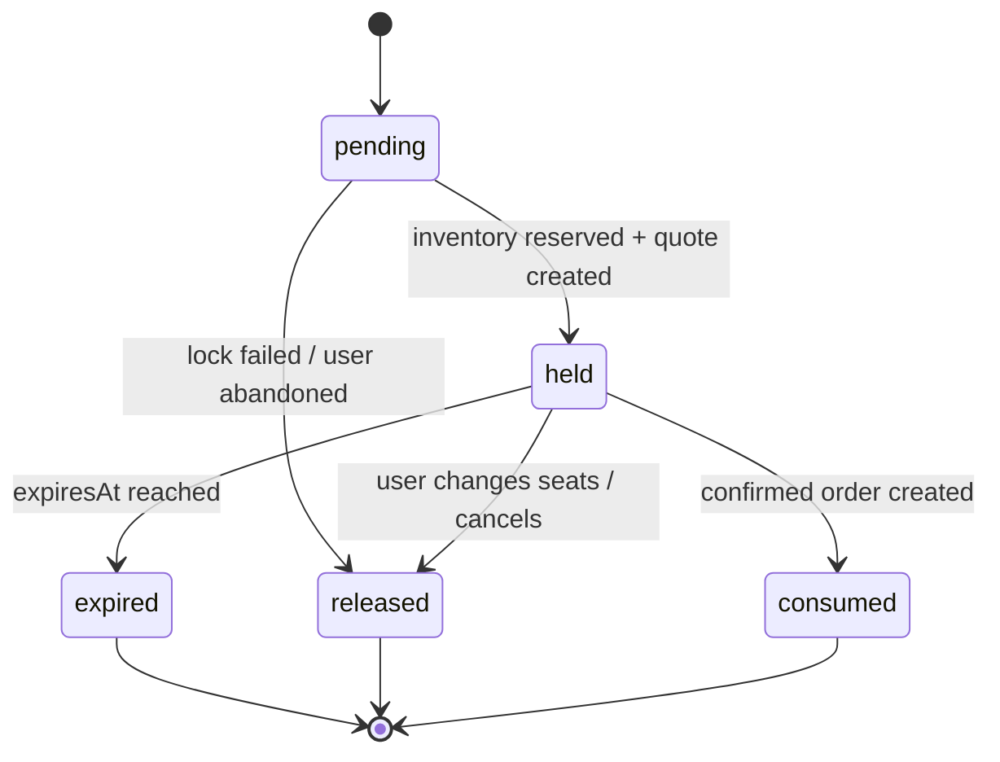

# RFC：Commercial Booking Domain / Storage v3

> 状态：Accepted for implementation  
> 日期：2026-07-18  
> 路线图：`doc/COMMERCIAL_UX_ROADMAP.md` Phase 1

## 1. 决策摘要

第二阶段不修改现有 v2 模块的语义来“勉强兼容”商业购票，而是在旁路建立明确的 v3 商业领域；当 v3 契约、迁移和浏览器垂直切片通过后，再切换 composition root 并删除被替代的 v2 生产入口。

关键决策：

1. 金额统一使用整数分（minor units），币种默认 CNY；
2. Catalog 与交易状态分离：电影/影院/影厅/场次/票种/政策是目录，库存/hold/订单是交易；
3. 票种与数量先于座位，`BookingDraft` 允许未选满，但创建 hold 时必须严格相等；
4. `SeatHold` 是独立聚合，不再由 `CheckoutIntent` 假扮；
5. 库存通过 `holdIdsBySeatId` 引用 hold，避免在多个对象复制“谁占了这个座位”；
6. `SeatHold` 和库存变更必须在同一个 repository revision 事务中提交；
7. 订单保存目录、政策、票种、价格和席位的不可变快照；
8. 商业规则使用 policy 配置，不硬编码某一家影院的全部规则；
9. v2 继续可读，v3 迁移成功前绝不删除 v2 key；
10. 领域层不依赖 DOM、LocalStorage、系统时间、随机数或网络。

## 2. 模块边界

```text
src/domain/
├── Money.js
├── catalog/
│   ├── Movie.js
│   ├── Cinema.js
│   ├── Auditorium.js
│   ├── Showtime.js
│   ├── TicketType.js
│   ├── PricingPolicy.js
│   └── RefundPolicy.js
├── booking/
│   ├── BookingDraft.js
│   ├── PricingQuote.js
│   ├── SeatSelectionPolicy.js
│   ├── ShowtimeInventory.js
│   ├── SeatHold.js
│   └── HoldBooking.js
└── order/
    └── CommercialOrder.js
```

Catalog 只描述可售产品，不知道当前用户；Booking 只处理草稿、库存与临时保留；Order 只保存已经确认的交易事实。

## 3. 标识与时间

- 所有实体 ID 为非空 opaque string，UI 不解析其结构；
- `SeatDefinition.id` 在 Auditorium 内稳定唯一；
- 所有持久化时间为 ISO 8601 字符串；
- 领域函数必须显式接收 `now`；
- `businessDate` 可从 startsAt 派生用于筛选，但库存键始终使用稳定 `showtimeId`；
- v2 `medium:day:3` 只在 migration adapter 中解析，不能进入新 UI。

## 4. Money

```js
{
    amount: 6800,
    currency: 'CNY'
}
```

- `amount` 是非负整数分；
- 加减只允许同币种；
- 任何总价都必须从规范化 line items 重算；
- UI 仅格式化，不计算价格。

## 5. BookingDraft

```js
{
    showtimeId,
    ticketItems: [{ ticketTypeId, quantity }],
    selectedSeatIds: [],
    preferences: ['center', 'aisle'],
    accessibilityAcknowledged: false,
    updatedAt
}
```

草稿允许 `selectedSeatIds.length < ticketCount`，因为用户正在逐个选择；不允许超过票数。只有 `selectedSeatIds.length === ticketCount` 才能请求 hold。

## 6. SeatDefinition / Auditorium

每个可视座位是一个明确实体：

```js
{
    id: 'F-09',
    rowIndex: 5,
    columnIndex: 8,
    rowLabel: 'F',
    seatNumber: 9,
    label: 'F排9座',
    sectionId: 'main-center',
    zoneId: 'preferred',
    kind: 'standard',
    companionForSeatId: null,
    stepFree: false
}
```

`kind` 首轮支持：`standard`、`premium`、`wheelchair`、`companion`、`loveseat`。结构性空隙不是 seat，不进入数组。过道通过不同 `sectionId` 或列坐标间隔表达。

## 7. SeatSelectionPolicy

首轮可配置规则：

- `maxTicketsPerOrder`，默认 8；
- `requireSameSection`，默认 true；
- `preventOrphanSeat`，默认 true；
- `companionRequiresWheelchairSpace`，默认 true；
- 无障碍/陪同席需要一次明确用途确认，但不要求证明；
- 孤座定义为同一行/区块内，被已售、有效 hold 或本次选择从两侧夹住的唯一可售空座；
- 行边缘、过道边缘、结构空隙和无障碍专用区不按普通孤座处理。

返回稳定错误码，UI 负责把错误定位到座位：

```text
TICKET_COUNT_MISMATCH
SEAT_UNAVAILABLE
SEAT_NOT_FOUND
CROSS_SECTION_SELECTION
ORPHAN_SEAT_CREATED
ACCESSIBLE_SEAT_ACKNOWLEDGEMENT_REQUIRED
COMPANION_REQUIRES_WHEELCHAIR_SPACE
```

## 8. ShowtimeInventory

```js
{
    showtimeId,
    revision,
    soldSeatIds: [],
    holdIdsBySeatId: { 'F-09': 'hold-123' },
    updatedAt
}
```

- `soldSeatIds` 与 `holdIdsBySeatId` 不得重叠；
- reserve、release、consume 均返回新冻结对象；
- reserve 任一座位失败时整组失败；
- consume 只有 hold 自己映射的全部座位才能成功；
- consume 将映射移除并原子加入 sold；
- revision 每次有效变更增加 1。

## 9. SeatHold 状态机



- `pending` 不代表座位已保留；
- `held` 必须有 `heldAt`、`expiresAt`、pricing quote 与 inventory revision；
- `expired`、`released`、`consumed` 是终态；
- 终态转换重复调用返回稳定错误，不默默修改；
- 默认 hold 时长由场次/渠道 policy 提供，首轮 demo 为 10 分钟，不能散落 magic number。

## 10. PricingQuote

```text
ticketSubtotal
+ ticketTypeAdjustments
+ seatZoneSurcharges
+ serviceFee
- discount
= total
```

Quote 保存 line items、币种、创建时间与 policyId。创建 hold 时生成；确认订单必须复用 hold 内的 quote，不能按当前价格重新计算。

## 11. CommercialOrder

订单保存：

- `movieSnapshot`；
- `cinemaSnapshot`；
- `auditoriumSnapshot`；
- `showtimeSnapshot`；
- `ticketItems`；
- `seatSnapshots`；
- `pricingQuote`；
- `refundPolicySnapshot`；
- `ticketCode` 与 `qrPayload`；
- confirmed/cancelled/refund 时间线。

目录后续改名、调价或删除场次，不得改变历史订单呈现。

## 12. Storage v3 Envelope

```js
{
    schemaVersion: 3,
    revision,
    updatedAt,
    usersById,
    session,
    ordersById,
    inventoriesByShowtime,
    holdsById,
    settingsByUser,
    migration: {
        fromVersion: 2,
        completedAt,
        warnings,
        sourceBackupKey
    }
}
```

Catalog 首轮由只读 repository/fixture 提供，不写入用户状态。这样目录更新与用户交易迁移可独立处理。

## 13. v2 → v3 映射

| v2 | v3 |
| --- | --- |
| `small|medium|large:day:N` | 映射到 `legacy` Movie/Cinema/Auditorium/Showtime 目录项 |
| `unitPrice` 元整数 | `amount = unitPrice * 100` 分 |
| confirmed order | CommercialOrder，保留原 ID、idempotencyKey、座位和金额 |
| cancelled order | 状态与退款快照迁移，缺失政策标记 `legacy-unknown` |
| inventory soldSeatKeys | v3 soldSeatIds，使用 legacy auditorium seat ID 映射 |
| CheckoutIntent | 不迁移为 active hold；只作为可丢弃跨页暂态清理 |
| settings | 保留可访问性、语言与 motion；消费者页面不再暴露 accent/realtime |

旧数据无法得知电影、影院和具体时间，因此迁移只能使用明确标记的 legacy 快照，不能假装为真实场次。

## 14. 切换策略

1. 新领域与测试旁路建立；
2. v3 validator/repository/migration 通过冻结 fixture；
3. 建立一条新购票 vertical slice；
4. 浏览器同时验证新旧入口，但生产首页只保留一个入口；
5. 切换 composition root 到 v3；
6. v2 保留只读迁移适配器；
7. 删除旧 Canvas/评分/热图生产链及等价旧测试。

## 15. 反对方案

### 直接扩展旧 ShowtimeId

拒绝。把更多字段编码进字符串会继续让 UI 解析内部 ID，且无法表达目录版本和订单快照。

### CheckoutIntent 增加一个 `locked: true`

拒绝。它没有进入共享库存，也没有完整状态机；布尔值不能表达 pending、conflict、expired、released 和 consumed。

### 继续由 SeatData 计算价格

拒绝。SeatData 是 mutable 视图模型，不能成为交易价格事实源。

### 一次性删除 v2

拒绝。现有 105 个测试与用户数据是重要资产，必须通过迁移和垂直切片逐步替换。
