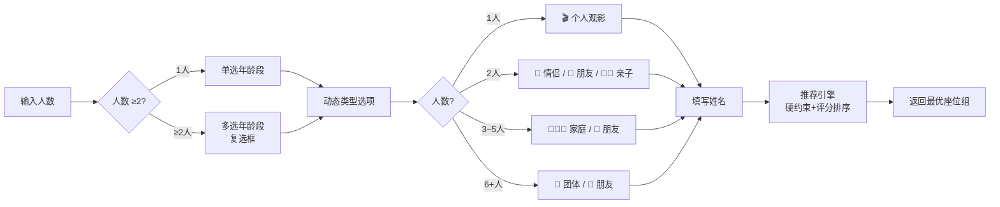
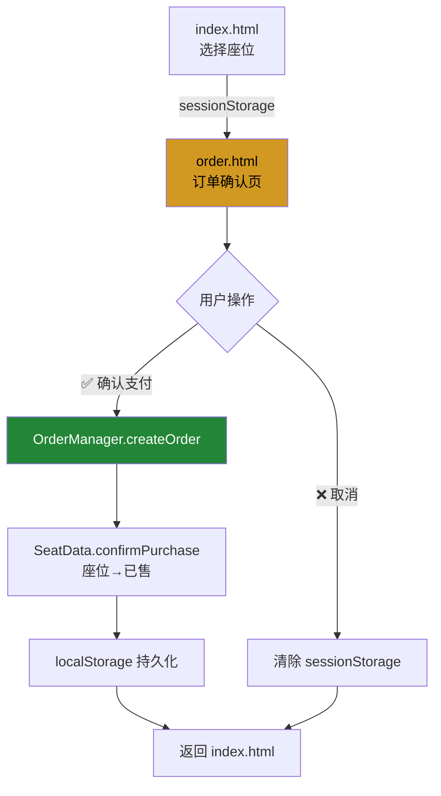

# SmartCinema 用户操作流程图

> 版本：v3 | 日期：2026-07-11

---

## 核心流程概览

SmartCinema 的核心选座流程设计为 **≤3 步**：

```
登录 → 选座 → 确认支付
```

---

## 一、主流程图

```mermaid
flowchart TD
    Start([用户访问 SmartCinema]) --> Login{已登录?}
    Login -->|否| Auth[📝 注册/登录]
    Auth --> Login

    Login -->|是| Choose{选座方式}

    Choose -->|智能推荐| R1[① 选择观影人数<br/>1~20人]
    R1 --> R2[② 选择年龄段<br/>1人:单选 / ≥2人:多选]
    R2 --> R3[③ 选择观影类型<br/>根据人数动态关联]
    R3 --> R4[④ 填写姓名<br/>1人:姓名框 / ≥2人:成员列表]
    R4 --> R5[🎯 执行推荐]
    R5 --> R6[查看推荐结果<br/>座位高亮+理由]
    R6 --> R7{满意?}
    R7 -->|否| R1
    R7 -->|是| R8[✓ 应用推荐]

    Choose -->|手动选座| M1[🖱️ 点击座位切换选中]
    M1 --> M2[🖱️ 拖拽框选多座]
    M2 --> M3[📊 实时查看评分]

    R8 --> Score[📊 系统自动评分<br/>显示四维度+总分]
    M3 --> Score

    Score --> Manual{手动评分?}
    Manual -->|是| MS[✍️ 调整四维度滑块<br/>提交综合评分]
    MS --> Submit
    Manual -->|否| Submit

    Submit[🛒 点击"提交订单"] --> Order[📋 订单确认页<br/>座位明细+费用]
    Order --> Decide{确认?}
    Decide -->|✅ 确认支付| Pay[创建订单<br/>座位标记已售]
    Decide -->|❌ 取消| Back[返回选座页]
    Pay --> Done([✅ 完成])

    style Start fill:#1F6FEB,color:#fff
    style Done fill:#238636,color:#fff
    style R5 fill:#8B5CF6,color:#fff
    style Pay fill:#238636,color:#fff
    style Order fill:#D29922,color:#000
```

---

## 二、智能推荐子流程



### 硬约束规则

| 年龄段 | 约束 |
|--------|------|
| 少年（<15岁） | 禁止前三排（row 0-2） |
| 老年人（≥60岁） | 禁止后三排（row 7-9） |
| 成年人 | 无限制 |
| 团体（5-20人） | 必须同排连续 |
| 混合年龄段 | 取所有约束的并集 |

---

## 三、订单流程



### 数据传递方式

- **选座页 → 订单页**：`sessionStorage.setItem('smartcinema_order_summary', JSON)`
- **订单持久化**：`localStorage.setItem('smartcinema_orders', JSON)`
- **跨页已售同步**：`localStorage.setItem('smartcinema_order_sold', JSON)`

---

## 四、三步骤总结

| 步骤 | 操作 | 耗时估算 |
|------|------|---------|
| **Step 1** | 登录 + 选择放映厅/日期 | ~10s |
| **Step 2** | 智能推荐(填表单→执行) 或 手动点击选座 | ~20s |
| **Step 3** | 查看评分 → 提交订单 → 确认支付 | ~10s |
| **合计** | | **~40s** |

> 满足大作业要求：操作流程 ≤ 3 步，用户体验流畅高效。
