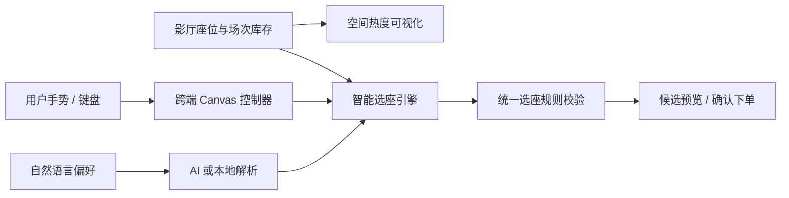

# SmartCinema 核心技术设计：源码解读

本文对应答辩 PPT 的“核心技术设计”部分。它不按产品功能编号叙述，而是围绕三个可复用的技术能力展开：**空间热度可视化**、**跨端选座交互**与**智能选座引擎**。其中“连座推荐”和“AI 偏好理解”共同构成智能选座引擎的两个阶段：前者生成并筛选合法候选，后者把自然语言偏好转换为候选排序依据。

核心边界如下：Canvas 只负责渲染和输入；AI 只负责理解偏好；库存、无障碍与选座规则始终由本地领域逻辑验证。这样无论 UI 如何变化、AI 是否可用，任何最终座位方案都必须通过同一套规则。



---

## 1. 空间热度可视化：将座位数据变成可读的空间趋势

主要源码：[CanvasSeatMapView.js](../src/ui/canvas/CanvasSeatMapView.js)

这一部分由同一份座位布局驱动两层画面：前景是可点击的座椅，背景是连续变化的热度图。两层使用同一套几何坐标，因此热区与具体座位不会发生错位。

### 1.1 热度不是随机数：基线、时段与确定性扰动

每个座位已有一个 `popularity.score` 作为基础热度。日视图在此基础上叠加三种影响：星期整体系数、座位—星期组合的确定性扰动、以及周末中央区加成。

```js
function hashSeatPeriod(seat, period) {
    const source = `${seat.id}:${period}`;
    let hash = 2166136261;
    for (let index = 0; index < source.length; index++) {
        hash ^= source.charCodeAt(index);
        hash = Math.imul(hash, 16777619);
    }
    return ((hash >>> 0) % 1000) / 1000;
}

export function heatScoreForPeriod(seat, popularity, period = 'week') {
    const normalizedPeriod = HEAT_PERIODS.includes(period) ? period : 'week';
    const base = clamp(Number(popularity?.score || 0) / 100);
    if (normalizedPeriod === 'week') return Math.round(base * 100);

    const dayFactor = PERIOD_FACTORS[normalizedPeriod];
    const deterministicVariation = (hashSeatPeriod(seat, normalizedPeriod) - 0.5) * 0.16;
    const weekendCenterLift = ['friday', 'saturday', 'sunday'].includes(normalizedPeriod) &&
        seat.sectionId === 'center' ? 0.06 : 0;
    return Math.round(clamp(base * dayFactor + deterministicVariation + weekendCenterLift) * 100);
}
```

这段实现的关键不在于哈希算法本身，而在于它替代了 `Math.random()`。`seat.id:period` 相同，哈希结果就相同；因此同一座位在同一时段的热度跨刷新保持一致，既能呈现座位之间的细微差异，又不会使演示、截图或测试不可复现。

`PERIOD_FACTORS` 让周一至周日呈现整体强弱差异，例如周六为 `1.18`，周一为 `0.72`。中央区加成只在周五、周六、周日生效，且仅增加 `0.06`。所有结果最后经过 `clamp` 限制在 0--100 的有效范围内。这是一种**确定性的演示数据模型**，用于表达“热度随时间和区域变化”，不宣称为真实商业客流预测。

### 1.2 弧形影厅几何：座位位置、过道与朝向来自同一公式

`createCurvedSeatLayout` 把领域中的离散 `rowIndex`、`columnIndex`、`sectionId` 转换为 Canvas 坐标。它首先根据相邻列 `sectionId` 的变化识别过道；过道不是一个假座位，而是在横向坐标计算时插入额外间隔。

```js
const aisleAfterColumns = [];
for (let columnIndex = 0; columnIndex < maxColumnIndex; columnIndex++) {
    if (sectionByColumn.get(columnIndex) !== sectionByColumn.get(columnIndex + 1)) {
        aisleAfterColumns.push(columnIndex);
    }
}
const aisleCountBefore = columnIndex =>
    aisleAfterColumns.filter(boundary => boundary < columnIndex).length;
const horizontalOffset = columnIndex =>
    columnIndex * columnStep + aisleCountBefore(columnIndex) * aisleGap;
```

`horizontalOffset` 在普通列距 `columnStep` 之外，累加该列之前所有过道的 `aisleGap`。因此后续的命中检测、热图采样、座椅绘制都以真实的“跨过道后更远”的坐标工作，而不是仅在视觉上留白。

弧形由归一化横坐标上的抛物线产生：

```js
const seatOffsetX = horizontalOffset(seat.columnIndex);
const normalizedX = halfSpan === 0 ? 0 : (seatOffsetX - halfSpan) / halfSpan;
const curveOffset = curveDepth * (1 - normalizedX * normalizedX);
const x = startX + seatOffsetX;
const y = top + seat.rowIndex * rowStep + curveOffset;
const slope = halfSpan === 0 ? 0 : (-2 * curveDepth * normalizedX) / halfSpan;

return Object.freeze({
    ...seat,
    x,
    y,
    centerX: x + seatWidth / 2,
    centerY: y + seatHeight / 2,
    rotation: Math.atan(slope)
});
```

令 (u\in[-1,1]) 表示 `normalizedX`，则垂直偏移为

\[
  y_{curve}=d(1-u^2).
\]

影厅中部偏移最大、两侧趋近于零，所以每排在中间下沉、靠过道处上扬，形成朝银幕展开的弧形。`slope` 是该抛物线的导数；座椅旋转 `atan(slope)`，使座椅方向也随曲线渐变，而非仅把矩形图标摆到一条弧线上。

`Object.freeze` 使计算出的布局成为不可变快照。热图、座位渲染、框选和命中检测共享这一快照，可避免其中一层修改坐标后造成另一层错位。

### 1.3 高斯核插值：从座位点值到连续热场

热图不把每个座位画成一块颜色，而是对低分辨率画布中的每个像素，计算其附近座位的加权平均：

```js
const radius = layout.columnCount >= 30 ? 84 : (layout.columnCount >= 20 ? 76 : 68);
const radiusSquared = radius * radius;

for (const sample of samples) {
    const dx = x - sample.x;
    const dy = y - sample.y;
    const distanceSquared = dx * dx + dy * dy;
    if (distanceSquared > radiusSquared * 4) continue;
    const weight = Math.exp(-distanceSquared / (2 * radiusSquared));
    weightedHeat += sample.heat * weight;
    totalWeight += weight;
}
if (totalWeight < 0.035) continue;
const heat = clamp(weightedHeat / totalWeight);
```

其数学形式为：

\[
H(p)=\frac{\sum_i h_i\exp\left(-\frac{\lVert p-p_i\rVert^2}{2r^2}\right)}
{\sum_i \exp\left(-\frac{\lVert p-p_i\rVert^2}{2r^2}\right)}.
\]

- (p_i) 是第 (i) 个座位的中心坐标，(h_i) 是该座位的热度；
- 距离越远，指数权重衰减越快；
- 仅计算 `distanceSquared <= 4r²` 的座位，截断极小权重以控制计算量；
- `radius` 随影厅列数增长，避免大影厅出现彼此孤立的热斑，小影厅又避免被过度模糊。

渲染时并非直接把 `heat` 写为不透明颜色，而是计算边缘淡出与覆盖度：

```js
const horizontalFade = clamp(Math.min(x - leftEdge, rightEdge - x) / radius);
const verticalFade = clamp(Math.min(y - topEdge, bottomEdge - y) / radius);
const coverage = Math.min(horizontalFade, verticalFade, clamp(totalWeight / 1.65));
const [red, green, blue] = colorAt(stops, heat);
const alpha = Math.round(255 * coverage * (theme.highContrast ? 0.22 : 0.36));
```

`coverage` 同时受边缘距离和附近样本密度约束：无座位区域不会出现无意义的色块，热图边缘也不会被硬切断。颜色使用冷色—暖色—热色—强调色的分段线性插值；高对比度模式降低透明度，避免热图压低座椅状态颜色的辨识度。

热图以 `scale = 4` 在较小位图上计算，再放大绘制。这是有意识的性能折中：视觉上保持连续，像素循环数量约降至原来的十六分之一。

---

## 2. 跨端选座交互：Canvas 中的统一坐标与意图分流

主要源码：[SeatMapController.js](../src/ui/controllers/SeatMapController.js)、[CanvasSeatMapView.js](../src/ui/canvas/CanvasSeatMapView.js)

Canvas 适合批量绘制座位和叠加热图，但它没有原生的按钮、焦点和手势语义。控制器的职责是将鼠标、触控、键盘事件转换为统一的座位选择或视图变换，并显式处理 PC 与移动端对“拖动”的不同理解。

### 2.1 逻辑坐标与物理像素分离

`prepareCanvas` 保持 CSS 尺寸为布局使用的逻辑尺寸，同时放大内部位图以适配高分屏：

```js
export function prepareCanvas(canvas, width, height) {
    const ratio = Math.min(2, globalThis.devicePixelRatio || 1);
    const pixelWidth = Math.round(width * ratio);
    const pixelHeight = Math.round(height * ratio);
    if (canvas.width !== pixelWidth || canvas.height !== pixelHeight) {
        canvas.width = pixelWidth;
        canvas.height = pixelHeight;
    }
    canvas.style.width = `${width}px`;
    canvas.style.height = `${height}px`;
    const context = canvas.getContext('2d');
    context.setTransform(ratio, 0, 0, ratio, 0, 0);
    context.clearRect(0, 0, width, height);
    return context;
}
```

`canvas.width` 与 `canvas.style.width` 的区别非常重要：前者决定实际像素缓冲区，后者决定页面中的显示大小。将二者按 `devicePixelRatio` 分离后，绘制 API 仍接受逻辑坐标，座椅既不会因 Retina 屏而模糊，也不需要为命中检测维护另一套坐标。

事件坐标会被反向映射回逻辑坐标：

```js
export function canvasPoint(canvas, event) {
    const bounds = canvas.getBoundingClientRect();
    const scaleX = Number.parseFloat(canvas.style.width) / Math.max(1, bounds.width);
    const scaleY = Number.parseFloat(canvas.style.height) / Math.max(1, bounds.height);
    return Object.freeze({
        x: (event.clientX - bounds.left) * scaleX,
        y: (event.clientY - bounds.top) * scaleY
    });
}
```

即使浏览器缩放、CSS 宽度或设备像素比变化，`canvasPoint` 仍输出与 `createCurvedSeatLayout` 相同坐标系中的点，随后由 `hitTestSeat` 命中座位。

### 2.2 PC：点击与框选是两条不同的输入路径

鼠标按下时先建立一个尚未激活的 `drag`；只有移动距离超过 8 像素才认为用户要框选。

```js
this.drag = {
    startX: point.x,
    startY: point.y,
    endX: point.x,
    endY: point.y,
    active: false,
    mode: 'toggle'
};

if (Math.hypot(point.x - this.drag.startX, point.y - this.drag.startY) > 8) {
    this.drag.active = true;
    this.suppressNextClick = true;
}
```

抬起鼠标时，只有 `active` 为真才调用 `seatsInsideRectangle`；框内座位还会过滤已售、被锁定和轮椅/陪同席：

```js
const seatIds = seatsInsideRectangle(this.layout, drag)
    .filter(seat => !this._isUnavailable(seat.id) &&
        !['wheelchair', 'companion'].includes(seat.kind))
    .map(seat => seat.id);
if (seatIds.length > 0) this.onSelectSeats(seatIds, { mode: drag.mode });
```

`suppressNextClick` 防止浏览器在拖拽结束后继续派发一个 `click`，将最后经过的座位意外切换。这使“轻点单座”和“拖出矩形多选”成为可区分、互不串扰的状态机分支。

### 2.3 移动端：先判断意图，再决定选座、平移或缩放

移动端的复杂性在于同一根手指可能意味着点按、沿路径选座或平移视图。控制器使用 `PAN_THRESHOLD = 7` 像素作为判定阈值。

```js
if (touchSelect.tapOnly && Math.hypot(deltaX, deltaY) >= PAN_THRESHOLD) {
    this.touchSelect = null;
    this.touchPan = { /* 保留起点和当前 pan */ active: true };
    this._suppressSyntheticClick();
    this._handleTouchPanMove({ point, preventDefault });
    return;
}
if (!touchSelect.active && Math.hypot(deltaX, deltaY) >= PAN_THRESHOLD) {
    touchSelect.active = true;
    this._suppressSyntheticClick();
}
```

普通可选座位可以进入路径选座；轮椅位和陪同席则被设为 `tapOnly`。当用户在特殊座位上滑动时，控制器立即把状态从 `touchSelect` 转为 `touchPan`，不会因为滑动误占用无障碍资源。

路径选座并不只检测每次 `touchmove` 的终点，而是按每 7 像素补点：

```js
const distance = Math.hypot(to.x - from.x, to.y - from.y);
const steps = Math.max(1, Math.ceil(distance / 7));
for (let index = 0; index <= steps; index++) {
    const amount = index / steps;
    const point = {
        x: from.x + (to.x - from.x) * amount,
        y: from.y + (to.y - from.y) * amount
    };
    const seat = this._seatAtTouchPoint(point);
    if (this._canAddTouchSelectedSeat(seat) && !this.touchSelect.seatIds.has(seat.id)) {
        this.touchSelect.seatIds.add(seat.id);
    }
}
```

因为浏览器不保证每次移动都触发足够密集的事件，插值采样可避免手指快速划过时漏选中间座位。

双指操作以两指中点为缩放锚点：

```js
this.pinch = {
    distance: Math.max(1, pointerDistance(left, right)),
    scale: this.view.scale,
    anchorX: (midpoint.x - this.view.panX) / this.view.scale,
    anchorY: (midpoint.y - this.view.panY) / this.view.scale,
    midpoint
};

const nextScale = this.pinch.scale *
    (pointerDistance(left, right) / this.pinch.distance);
const next = this._pinchViewAt(midpoint, nextScale);
```

`anchorX`、`anchorY` 是手势开始时中点对应的内容坐标。缩放时采用

\[
  pan_x=m_x-anchor_x\cdot scale,\qquad
  pan_y=m_y-anchor_y\cdot scale,
\]

因此用户手指下的座位在缩放过程中保持在手指下，而不是缩放后跳到别处。

平移和缩放允许在手势中轻微越界，但使用 `rubberband` 将越界量缩为 20%；松手后 `_settleView` 将视图动画回合法边界。这既提供“到边了”的触觉式视觉反馈，又确保最终视图不会丢失座位图。

### 2.4 Canvas 不是无障碍黑盒

控制器保留键盘焦点与虚拟焦点：空格切换当前座位；左右键在同排移动；上下键选择最近的一行座位；Home/End 直达本排两端。

```js
if ([' ', 'Space', 'Spacebar'].includes(event.key)) {
    event.preventDefault();
    if (this.lastFocusedSeatId && !this._isUnavailable(this.lastFocusedSeatId)) {
        this.onToggleSeat(this.lastFocusedSeatId);
    }
    return;
}
const target = this._nextSeat(this.lastFocusedSeatId, event.key);
this.lastFocusedSeatId = target.id;
this.canvas.setAttribute('aria-activedescendant', `seat-option-${target.id}`);
```

页面还维护带 `data-seat-id` 的语义按钮层，`_handleSemanticKeydown` 与 Canvas 键盘逻辑共享 `_nextSeat`。因此视觉上的 Canvas 与辅助技术可访问的座位列表使用同一套导航规则，而不是两份容易漂移的实现。

---

## 3. 智能选座引擎（一）：先生成合法连座，再进行排序

主要源码：[RecommendSeatBlock.js](../src/application/ticketing/RecommendSeatBlock.js)、[SeatSelectionPolicy.js](../src/domain/booking/SeatSelectionPolicy.js)

智能选座不是直接挑一个“评分最高”的位置。它先枚举满足人数的空间结构，再通过统一规则校验；只有已经合法的候选才进入偏好、年龄、体验和价格的排序。这个顺序避免了用分数掩盖规则违规。

### 3.1 同排候选：连续列的滑动窗口

```js
function contiguousWindows(seats, count) {
    const windows = [];
    for (let start = 0; start <= seats.length - count; start++) {
        const candidate = seats.slice(start, start + count);
        if (candidate.every((seat, index) =>
            index === 0 || seat.columnIndex === candidate[index - 1].columnIndex + 1
        )) {
            windows.push(candidate);
        }
    }
    return windows;
}
```

可用座位会先按排分组、按列排序。随后长度为 `ticketCount` 的窗口逐个滑动，只有相邻座位的 `columnIndex` 连续递增才成为候选。这样排除了“中间隔着已售座位”或“跨过空列”的伪连座。

### 3.2 相邻两排候选：受限的降级，而不是任意拼座

当人数不少于 3 且同行类型为朋友、家庭或团体时，算法还允许紧凑的前后两排方案：

```js
function supportsAdjacentRows(draft) {
    return draft.ticketCount >= 3 &&
        ['friends', 'family', 'group'].includes(draft.partyType);
}

for (let centerKey = upper.centerKey - 2; centerKey <= upper.centerKey + 2; centerKey++) {
    (lowerWindowsByCenter.get(centerKey) || []).forEach(lower => {
        const seats = [...upper.seats, ...lower.seats];
        if (new Set(seats.map(seat => seat.sectionId)).size !== 1) return;
        // 记录 rowSpan、centerOffset、两排人数差和总包围宽度
    });
}
```

这里有四个约束：两排必须相邻；两个座位块的中心最多偏移一个列距（`centerKey ± 2`）；两排必须同分区；人数分配由 `adjacentRowPartitionSizes` 限制，避免形成极端不均衡的布局。它不是把剩余空座随意凑在一起，而是在同排无解或质量较低时提供空间上仍紧凑的替代方案。

### 3.3 规则集中校验：推荐函数不复制业务规则

每个候选先被写入不可变的 `BookingDraft`，随后调用唯一的 `validateSeatSelection`：

```js
const selected = replaceDraftSeats(draft, seats.map(seat => seat.id), updatedAt);
if (!selected.ok) continue;
const validation = validateSeatSelection({
    draft: selected.value,
    auditorium,
    inventory,
    policy
});
if (!validation.ok) continue;
```

校验器覆盖以下硬约束：

```js
if (draft.selectedSeatIds.length !== draft.ticketCount) {
    return err('TICKET_COUNT_MISMATCH', '选中座位数必须与票数一致');
}

const conflicts = draft.selectedSeatIds.filter(seatId => unavailable.has(seatId));
if (conflicts.length > 0) {
    return err('SEAT_UNAVAILABLE', '部分座位已不可用', { seatIds: conflicts });
}
```

除票数与库存外，`validateSeatSelection` 还处理：

- 跨分区只能在同排、列号真正连续时例外允许；
- 选中轮椅位或陪同席必须确认无障碍用途；
- 陪同席必须同时选择其对应轮椅位；
- 新选择不能在同一分区内造成两侧都不可用、中央只剩一个空座的“孤座”。

孤座检测的关键是比较选择前后的孤座集合，只拒绝**本次选择新制造**的孤座：

```js
const existingOrphans = new Set(findOrphanSeats(auditorium, unavailable));
const afterSelection = new Set([...unavailable, ...draft.selectedSeatIds]);
const orphanSeatIds = findOrphanSeats(auditorium, afterSelection)
    .filter(seatId => !existingOrphans.has(seatId));
if (orphanSeatIds.length > 0) {
    return err('ORPHAN_SEAT_CREATED', '当前选择会留下单个孤立空座', { seatIds: orphanSeatIds });
}
```

这避免把历史库存中已经存在的孤座误归因给当前用户。

### 3.4 排序是词典序比较，不是不可解释的大杂烩分数

`compareCandidates` 按固定优先级逐项比较。前面的差异一旦出现，后面的指标不再参与：

```js
if (left.audience.violatingSeatCount !== right.audience.violatingSeatCount) {
    return left.audience.violatingSeatCount - right.audience.violatingSeatCount;
}
if (left.audience.totalBoundaryDistance !== right.audience.totalBoundaryDistance) {
    return left.audience.totalBoundaryDistance - right.audience.totalBoundaryDistance;
}
if (left.arrangement.type !== right.arrangement.type) {
    return left.arrangement.type === 'same-row' ? -1 : 1;
}
if (left.crossesAisle !== right.crossesAisle) return left.crossesAisle ? 1 : -1;
```

实际优先顺序为：

1. 儿童避开前三排、长者避开后三排的违反座位数与违反距离；
2. 用户正在“换一组”时，保留已有座位数更多、移动距离更小的方案；
3. 同排优于相邻两排；两排时人数差更小、中心偏移更小者优先；
4. 不跨过道优先；
5. 如有 AI 偏好，比较 AI 向量匹配分；
6. 再比较传统位置偏好、观影体验、座位附加费与座位编号。

年龄建议并非绝对禁止。当存在完全满足年龄建议的候选时：

```js
const strictCandidates = allCandidates.filter(candidate => candidate.audience.satisfied);
const candidates = strictCandidates.length > 0 ? strictCandidates : allCandidates;
```

系统只使用 `strictCandidates`；只有严格候选为空才整体放宽，并用 `age-relaxed`、`adjacent-rows`、`cross-aisle`、`compromise` 标记方案级别。这个设计把“没有完美方案”显式交给用户，而不是悄悄降低标准。

最后 `diverseCandidates` 优先选择不同排次的方案，最多输出 5 组，避免五个候选只是同一排相邻窗口的微小位移。

---

## 4. 智能选座引擎（二）：AI 将自然语言转为可计算偏好，不越过规则边界

主要源码：[SeatPreferenceIntent.js](../src/domain/booking/SeatPreferenceIntent.js)、[SeatPreferenceVector.js](../src/domain/booking/SeatPreferenceVector.js)、[DeepSeekSeatPreferenceInterpreter.js](../src/infrastructure/ai/DeepSeekSeatPreferenceInterpreter.js)、[RuleBasedSeatPreferenceInterpreter.js](../src/infrastructure/ai/RuleBasedSeatPreferenceInterpreter.js)

AI 在此系统中的职责不是给出“第几排第几座”，而是产生 `SeatPreferenceIntent`。该对象描述用户想要的座位特征；真实座位仍由上一节的候选生成和规则校验决定。

### 4.1 意图模型：六个目标维度与归一化权重

```js
export const SEAT_PREFERENCE_DIMENSIONS = Object.freeze({
    screenDistance: '银幕距离',
    centerAlignment: '居中程度',
    surroundingSpace: '周边空位',
    priceLevel: '价格水平',
    lowDisturbance: '少受打扰',
    egressEase: '进出便捷'
});
```

每个维度的目标值位于 0--100；例如 `screenDistance=0` 表示靠近银幕，100 表示靠后，`centerAlignment=100` 表示水平正中。意图中还包含每个维度的权重、允许标签、约束布尔值和最多两条取舍说明。

输入不会被直接信任。`normalizeSeatPreferenceIntent` 会将数值截断到有效范围，过滤不在白名单中的标签，并将权重正规化为和为 1：

```js
DIMENSION_IDS.forEach(id => {
    const value = Number(input[id]);
    weights[id] = Number.isFinite(value) && value > 0 ? value : 0;
    total += weights[id];
});
if (total <= 0) return DEFAULT_SEAT_PREFERENCE_WEIGHTS;
DIMENSION_IDS.forEach(id => {
    weights[id] /= total;
});
```

因此无论远端模型还是本地规则返回何种数值，后续算法总能接收到完整、边界明确、可比较的向量。

### 4.2 远端 AI：只允许结构化输出，并有超时边界

DeepSeek 调用明确声明 `response_format: { type: 'json_object' }`，温度设为 `0.2`，并使用 `AbortController` 在 8 秒后中止：

```js
const controller = new AbortController();
const timeout = setTimeout(() => controller.abort(), timeoutMs);
try {
    const response = await fetch(apiUrl, {
        method: 'POST',
        signal: controller.signal,
        body: JSON.stringify({
            model,
            response_format: { type: 'json_object' },
            messages: [
                { role: 'system', content: SEAT_PREFERENCE_SYSTEM_PROMPT },
                { role: 'user', content: JSON.stringify({ preferenceText, context }) }
            ],
            temperature: 0.2
        })
    });
    const parsed = extractJsonObject(payload?.choices?.[0]?.message?.content);
    return normalizeSeatPreferenceIntent(parsed);
} finally {
    clearTimeout(timeout);
}
```

系统提示词禁止 AI 输出座位号或承诺真实人流、噪声、出口距离；它只能输出六维偏好、标签和取舍。`normalizeSeatPreferenceIntent` 是模型输出进入业务逻辑前的第二道边界。

### 4.3 本地回退：AI 不可用不影响选座

本地解释器通过关键词规则构造相同的数据结构。例如“安静、周围空一点”会同步提高少受打扰与周边空位的目标和权重：

```js
if (hasAny(normalizedText, [/安静/, /少人/, /人少/, /别被打扰/, /不被打扰/, /清净/, /周围.*空/, /空一点/])) {
    targets.lowDisturbance = 90;
    targets.surroundingSpace = 86;
    weights.lowDisturbance = 0.9;
    weights.surroundingSpace = 0.72;
    tags.push('quiet', 'spacious');
}
```

“老人、带小孩、靠过道”等词会提高 `egressEase`，并设置 `preferAisle` 或 `avoidFront`。预算与中心视野同时出现时，解释器也会写入显式取舍：

```js
if (constraints.budgetSensitive && (tags.includes('view') || tags.includes('center'))) {
    tradeoffs.push('控制加价可能会牺牲少量中心区优势。');
}
```

前端请求 AI 接口失败时，会在 `catch` 中立即调用本地解释器；所以 API 密钥缺失、网络异常、超时或错误响应都不会阻断候选预览。

### 4.4 从候选座位到偏好向量：可解释的距离计算

对每一组已合法候选，`evaluateSeatPreferenceVector` 根据影厅布局、库存与价格策略计算六维实际值。以“少受打扰”为例，它不假设真实噪声，而是把中心甜点区需求和邻近座位不可用比例组合为风险，再取反得到分数：

```js
const demand = clamp(
    (1 - Math.abs(seat.columnIndex - center) / Math.max(center, 1)) *
    (1 - Math.abs(seat.rowIndex - popularRow) / Math.max(maxRowIndex, 1)),
    0,
    1
);
const occupied = localUnavailableRatio(seat, auditorium, unavailable, selected);
return demand * 0.42 + occupied * 0.58;
```

候选向量 (v) 与目标向量 (t) 的差异为加权欧氏距离：

```js
const delta = ((vector[id] ?? 0) - normalizedTargets[id]) / 100;
squaredDistance += normalizedWeights[id] * delta * delta;
const distance = Math.sqrt(squaredDistance);
const score = Math.round(clamp(100 - distance * 100));
```

即

\[
d(v,t)=\sqrt{\sum_k w_k\left(\frac{v_k-t_k}{100}\right)^2},
\qquad score=100-100d.
\]

该分数只用于合法候选之间的比较。`recommendSeatBlocks` 先调用 `validateSeatSelection`，后计算 `advisorAssessment`，并在 `compareCandidates` 的后半段才比较 AI 得分。因此 AI 不能使已售座位、无障碍违规座位或非连座方案“凭偏好得分胜出”。

### 4.5 预览与提交分离：AI 推荐不会直接改写订单

`SeatAdvisorController` 收到推荐后只保存在 `preview` 中，并调用 `onPreview` 高亮：

```js
this.preview = {
    intent,
    source,
    candidates: recommendation.value.candidates.map(candidate => ({
        candidate,
        reason: candidate.reason
    })),
    currentIndex: 0,
    inventoryRevision: recommendation.value.inventoryRevision
};
this._showCurrentCandidate({ focusSeat: true });
```

只有用户点击“采用”才调用 `onApply`。若此时库存版本已变化，应用失败后会清除预览并要求重新生成。这将“AI 理解偏好”“显示候选”“写入座位草稿”分成三个可审计步骤，避免异步 AI 请求完成后静默覆盖用户当前选择。

---

## 5. 实现边界与验证重点

这四张技术页并非展示四个彼此独立的功能，而是展示一个完整选座系统的关键链路：

1. 空间热度可视化把座位级信息转为区域级决策线索；
2. 跨端 Canvas 控制器将不同输入设备的意图转换为稳定的座位选择；
3. 智能选座引擎枚举连座结构，统一校验硬约束，并进行可解释排序；
4. AI 偏好理解仅为同一引擎提供排序目标，并始终可回退到本地规则。

代码与自动化测试的验证重点包括：弧形布局与过道间距、星期热度的确定性、鼠标框选与移动端路径选座、双指锚点缩放、相邻两排候选、年龄建议的分级放宽、无障碍席位与陪同席约束、孤座拦截、AI 输出归一化以及库存变更后的预览失效。
